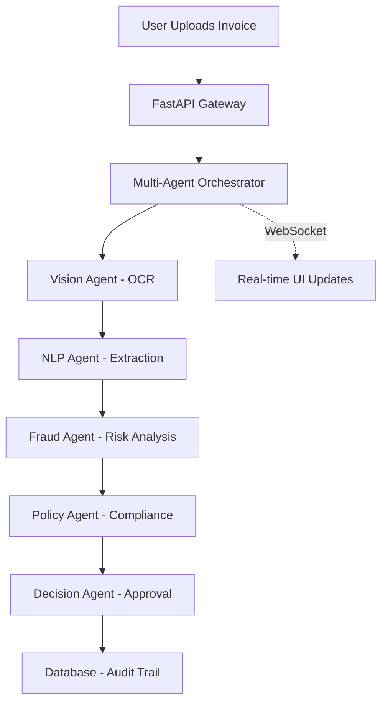

<div align="center">

# 🧾 InvoiceFlow AI

### Multi-Agent Invoice Processing System

*Automate invoice processing with AI agents - from OCR to approval in under 5 seconds*

[](https://opensource.org/licenses/MIT)
[](https://www.python.org/downloads/)
[](https://fastapi.tiangolo.com/)

</div>

---

## 📖 Overview

**InvoiceFlow AI** is an enterprise-grade invoice automation system powered by five specialized AI agents. It orchestrates OCR extracting, fraud detection, policy validation, and final approval decision-making with complete audit trails, processing invoices in under 5 seconds.

## 🏗️ Architecture



### 🤖 Agent System

| Agent | Function | Technology |
|-------|----------|------------|
| **Vision** | OCR text extraction from PDFs/Images | EasyOCR |
| **NLP** | Structured data parsing (Vendor, Date, Amount) | spaCy NER |
| **Fraud** | Duplicate detection & risk scoring | Statistical Analysis |
| **Policy** | Business rule validation & thresholds | Rule Engine |
| **Decision** | Final approval logic & confidence scoring | Ensemble Logic |

## 🛠️ Tech Stack

- **Backend:** FastAPI, Python 3.9, Celery
- **Database:** PostgreSQL (with SQLAlchemy), Redis
- **AI/ML:** EasyOCR, spaCy, scikit-learn
- **Infrastructure:** Docker Compose

## 🚀 Quick Start

### Prerequisites
- Docker & Docker Desktop

### Run with Docker

1. **Clone the repository**
   ```bash
   git clone https://github.com/Ritinpaul/InvoiceFlow-AI.git
   cd InvoiceFlow-AI
   ```

2. **Start Services**
   ```bash
   docker-compose up -d
   ```

3. **Access Application**
   - **API Docs:** [http://localhost:8000/docs](http://localhost:8000/docs)
   - **Health Check:** [http://localhost:8000/health](http://localhost:8000/health)

## 📊 Core Endpoints

| Method | Endpoint | Description |
|--------|----------|-------------|
| `POST` | `/api/upload` | Upload invoice for processing |
| `GET` | `/api/invoices` | List processed invoices |
| `WS` | `/api/ws/{id}` | Real-time agent status stream |
| `GET` | `/api/stats` | System performance metrics |

---
*Licensed under MIT License*
